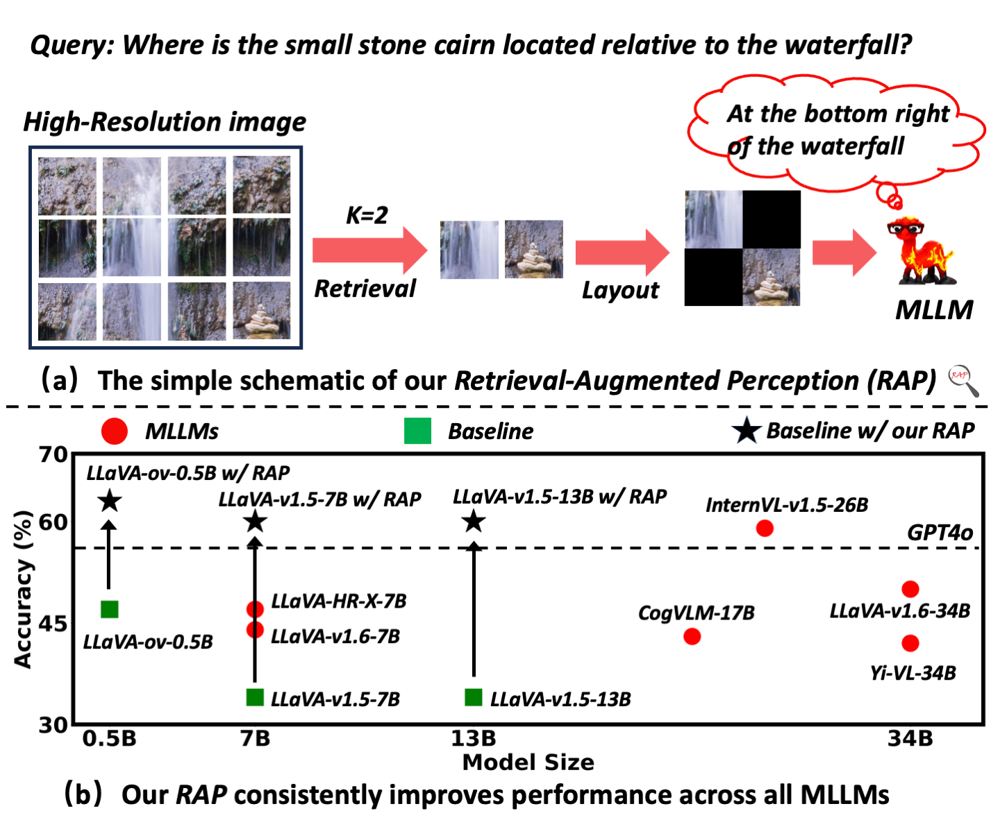

# <b><em>Retrieval-Augmented Perception</em></b>

<div align="center">
<a href="https://arxiv.org/abs/2503.01222" target="_blank">
    
</a>
<a href="https://dreammr.github.io/RAP" target="_blank">
    
</a>



This repo contains the official code for the paper "<b><em>Retrieval-Augmented Perception: High-Resolution Image Perception Meets Visual RAG</em></b>"

</div>

## 💡 Highlights

- 🔥 We propose ***RAP***, a training-free framework designed to enhance Multimodal Large Language Models' (MLLMs) ability to process high-resolution images effectively.

## 📜 News

**[2025.06.28]** We add a demo script `play.py` for inference on one image.

**[2025.06.07]** Our paper was accepted to ICML 2025 as an Oral paper (Top 1%)! 🎉

**[2025.05.05]** ***RAP*** code is available!
**[2025.05.05]** ***RAP*** code is available!

**[2025.03.04]** We released the [ArXiv paper](https://arxiv.org/abs/2503.01222). 🚀

## 👀 Introduction

High-resolution (HR) image perception remains a key challenge in multimodal large language models (MLLMs). To overcome the limitations of existing methods, this paper shifts away from prior dedicated heuristic approaches and revisits the most fundamental idea to HR perception by enhancing the long-context capability of MLLMs, driven by recent advances in long-context techniques like retrieval-augmented generation (RAG) for general LLMs.  Towards this end, this paper presents the first study exploring the use of RAG to address HR perception challenges. Specifically, we propose ***Retrieval-Augmented Perception (RAP)***, a training-free framework that retrieves and fuses relevant image crops while preserving spatial context using the proposed *Spatial-Awareness Layout*. To accommodate different tasks, the proposed *Retrieved-Exploration Search (RE-Search)* dynamically selects the optimal number of crops based on model confidence and retrieval scores. Experimental results on HR benchmarks demonstrate the significant effectiveness of ***RAP***, with LLaVA-v1.5-13B achieving a 43% improvement on $V^*$ **Bench** and 19% on ***HR-Bench***.


## ⚙️ Installation

1. Clone this repository and navigate to into the codebase
```bash
git clone https://github.com/DreamMr/RAP.git
cd RAP
```

2. Install Packages
```bash
conda create -n RAP python=3.10 -y
conda activate RAP
pip install -e .
```

## 📚 Preparation

### 1. MLLM & RAG Model

In this repo, we implement RAP with [LLaVA-OneVision (ov) series](https://huggingface.co/lmms-lab/llava-onevision-qwen2-0.5b-ov) and [VisRAG-Ret](https://huggingface.co/openbmb/VisRAG-Ret). You can either download these checkpoints manually beforehand or let them be fetched automatically when calling the from_pretrained method in transformers.

### 2. Evaluation data

Download the $V^*$ Bench and HR-Bench (Single) from the [link](https://drive.google.com/drive/folders/1rBr8dmVnwkEJMHawS9dzClDRYq_WyCl7?usp=sharing). Then copy the downloaded data to `LMUData`:
```bash
export LMUData=YOUR_DATASET_PATH
cp vstar.tsv $LMUData
cp hr_bench_4k_single.tsv $LMUData
cp hr_bench_8k_single.tsv $LMUData
```

## 🫵 Evaluation

### 1. Results of HR-Bench
```bash
cd scripts
bash run_llava_ov_hrbench.sh
```

> Note: Since the official HR-Bench uses Cyclic Permutation, in order to improve evaluation efficiency, we adopt a two-stage approach: 1) First, for each image and query, we use RAP to obtain key image crops; 2) Then, we use the images obtained in 1) to replace the original images as input.

### 2. Results of $V^*$ Bench
```bash
cd scripts
bash run_llava_ov_vstar.sh
```

### 3. Results of Vanilla

To enable better comparison, we also provide evaluation code without ***RAP***.

```bash
cd scripts
bash run_llava_ov_vanilla.sh
```

> Note: If an OOM (Out of Memory) error occurs during evaluation, please try reducing the number of `workers` (in `rap/inference.py` line 107) and the `max_batch_size` (in `rap/vlm/base.py` line 23).

## Run the demo
We offer a demo file for RAP that can process any given Image-Question pair.
### w/o RAP
```
python play.py --model llava_onevision_qwen2_0.5b_ov --image_path ./demo.jpg --input "What's the color of the umbrella?"
```

### w/ RAP
```
python play.py --model llava_onevision_qwen2_0.5b_ov --image_path ./demo.jpg --use_rap --input "What's the color of the umbrella?"
```

## 📧 Contact

- Wenbin Wang: wangwenbin97@whu.edu.cn 

## ✒️ Citation
If you use *RAP* in your research, please cite our work:
```
@inproceedings{wangretrieval,
  title={Retrieval-Augmented Perception: High-resolution Image Perception Meets Visual RAG},
  author={Wang, Wenbin and Jing, Yongcheng and Ding, Liang and Wang, Yingjie and Shen, Li and Luo, Yong and Du, Bo and Tao, Dacheng},
  booktitle={Forty-second International Conference on Machine Learning},
  url={https://arxiv.org/abs/2503.01222}
}
```

## Acknowledgement

- [VLMEvalKit](https://github.com/open-compass/VLMEvalKit): We start from codebase from the VLMEvalKit.
